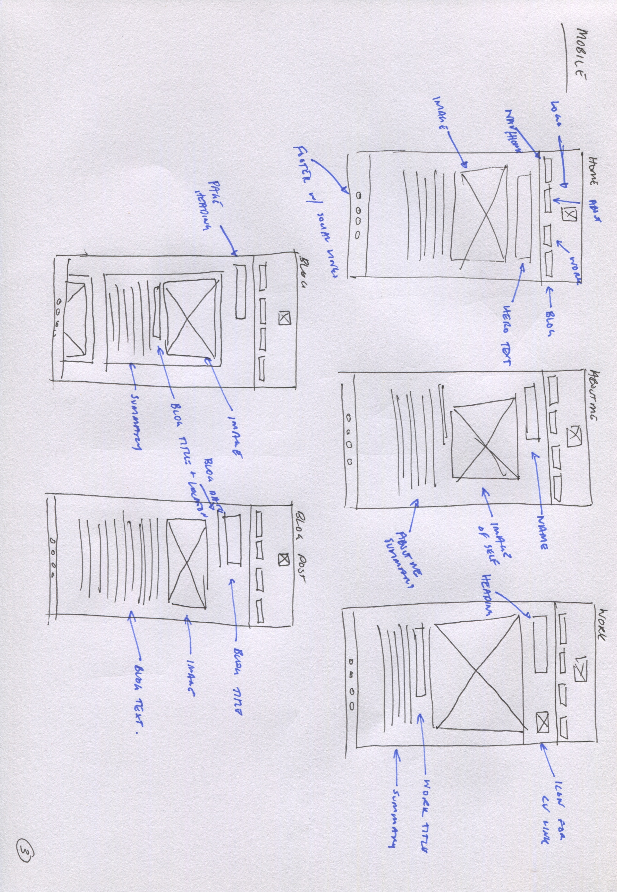

# Personal Portfolio 

## [Link to Portfolio Website](https://cameron-williams-t1-a2-m55o.vercel.app/index.html)
## [Github Repo Link](https://github.com/CameronWD/CameronWilliams_T1A2)
## [Presentation Link](https://youtu.be/dkzL1SRdf38)

## Portfolio Purpose

The purpose of this portfolio:

* Allow perspective employers to gauage who I am and why I may be a good fit for their company
* Showcase my skills and professioanl knowledge

## Functionality / Features:

Made with HTML and CSS this website aims to be functional at a wide range of screen resolutions, additionally being accessible. 

The ./src contains 5 html pages and one common css page that styles everything. 
* Index page that is to welcome users of the webpage. Includes information about what the website is for, hero text to stand out and an image of myself.
* About Me page has a small summary about me as a person, additionally photo and more hero text. 
* Work page is has majority placeholder text until i further develop my portfilo of projects. Styled to be easily readable and allow focus on the porjects. Includes a link to the pdf of my resume. 
* Blog page shows links to 6 template blogs. Includes dates as per marking sheet. Desktop allows for the containers to be highlighted with users able to click the read more button to go to the full scale article. 
* Blog Example page. Shows what the blog pages would link out to. 

Each page contains both a header and footer.

* Header includes the nav bar to the four main html pages and a personal logo
* Footer includes copyright information and social links to external sites. Github, Email, LinkedIn and Twitter. Not all my personal information is here. 

The site utilizes the following features:

* Utilized a mobile first approach to ensure that all features were viewable through the majority of viewport widths. 
    * Breakpoints at 540px, 750px, 1000px, 1300px and 2000px to help with readability
    * Used varying max width of images to ensure page was readable
    * Hero text has limits to help not dominating the screen too often
* Sites colour pallete uses neutral colours, domianted by gray, black and white with highlights of purple. This is in an effort to increase readability and allow the images to really stand out on the page. 
* Used semantics within the html where possible in an effort to increase accesibility. 

## Sitemap: 

--- 

## Wireframe images from the design phase of the website 

--- 

## Screenshots of mobile site

---

## Screenshots of tablet site

## Screenshots of desktop site

---

## Target Audience:

* The hope for this website is to be the building block to create engagment with employers in the hopes of getting a junior developer role. Individuals looking at this site are likely to have expertice within the development, web dev and coding field. Ideally, this website is an example of my skillset and what I would bring to the table. Those looking at the website already have technical knowledge and would hopefully gain appreciation due to the effort and outcome of this portfolio. 

## Tech stack:

* Wireframes - pen, paper, scanner
* Logo - Canva
* Website - CSS & HTMl
* Deployment: Vercel
* Slidedeck: Google Slides
* Screenshots: Mozilla Firefox