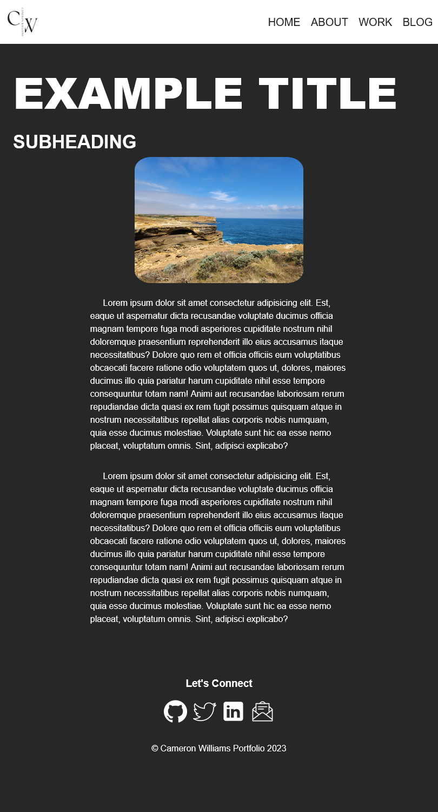

# Personal Portfolio 

## [Link to Portfolio Website](https://cameron-williams-t1-a2-m55o.vercel.app/index.html)
## [Github Repo Link](https://github.com/CameronWD/CameronWilliams_T1A2)
## [Presentation Link](https://youtu.be/dkzL1SRdf38)

## Portfolio Purpose

The purpose of this portfolio:

* Allow perspective employers to gauage who I am and why I may be a good fit for their company
* Showcase my skills and professioanl knowledge

## Functionality / Features:

## Sitemap: 

## Screenshots:

*Wireframe images from the design phase of the website 

*Screenshots of mobile site

*Screenshots of tablet site

*Screenshots of desktop site

## Target Audience:

## Tech stack: